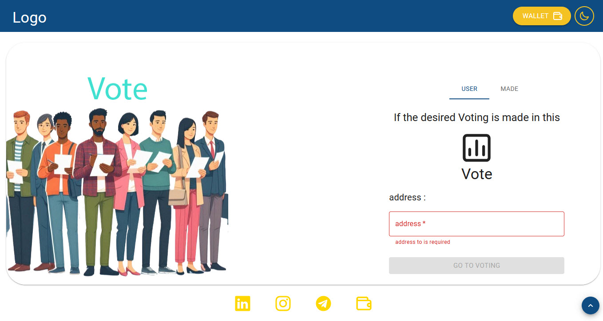
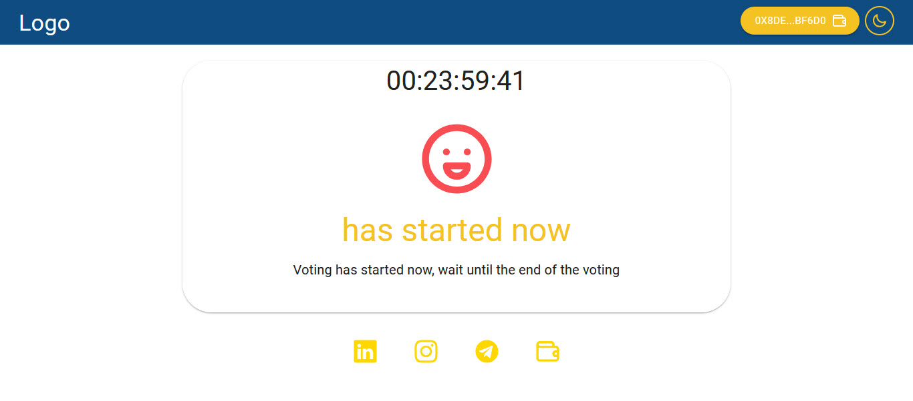

# Voting

Blockchain voting is a digital way of voting that uses blockchain technology. Here's how it works:

1. Registration: Citizens register and verify their identity on the blockchain.
2. Immutable Votes: Votes are recorded on the blockchain, making them unalterable and transparent.
3. Counting: The blockchain ensures accurate vote counting, leading to quick and clear election results.
   In summary, blockchain voting brings secure, transparent digital balloting, ensuring immutable and verifiable votes for enhanced democratic processes.

## Clone Repository

git clone https://github.com/mahdiZarrei/Voting.git
cd Voting

## Requirements

[node.js](https://nodejs.org/en/) v10.18.0+ And [Metamask](https://metamask.io/) extension on your browser

## Installation

Use the package manager [npm](https://www.npmjs.com/) to install Voting .

npm install

## Usage

npm run dev

Open localhost:5173 to access the application!

## Photo gallery

### Login Vote

### Made vote

### Start vote

### Candidates page

### you are not connected

### has started

## License

MIT
